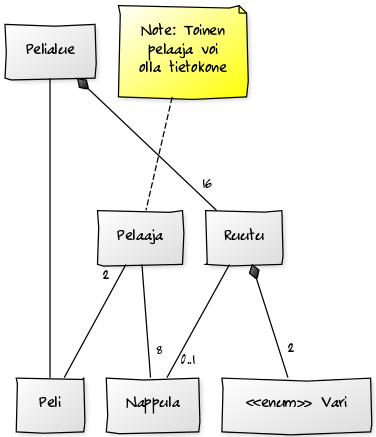

#**Xanadu**

**Aihe:** Ristinollaa 4x4 muotoisella pelialueella. Jokaisessa ruudussa on kaksi väriä. Peliä pelataan asettamalla vuorotellen nappuloita ruuduille. Pyrkimys on muodostaa suora. Et saa laittaa nappulaa mille tahansa ruudulle, vaan ainoastaan sellaiselle, jossa on jompaa kumpaa niistä väreistä, joita on edellisen pelaajan valitsemassa ruudussa. Peli päättyy, kun joko suora on muodostettu tai ei enää ole sallittuja paikkoja. Peli vaatii yksinkertaisen mutta dynaamisen ulkoasun. Peli-"kenttä" koostuu 16 kaksivärisestä ruudusta. Tavoitteenani on saada kenttä näyttämään erilaiselta jokaisella pelikerralla (ruutujen värit vaihtelevat).

**Käyttäjät:** Pelaaja (1 tai 2)

**Alkutoiminto:**

- Pelaajien määrän valitseminen

**Pelitoiminnot (yksi pelaaja):**

- Pelaa vuoro
  - Pelaaja etsii sallittuja ruutuja
  - Pelaaja valitsee yhden ruuduista
  - Pelaaja asettaa nappulan valitsemalleen ruudulle
- Tekoälyn vuoro
  - Tekoäly listaa sallitut ruudut
  - Tekoäly valitsee yhden ruuduista
  - Tekoäly asettaa nappulan valitsemalleen ruudulle
- Edelliset vaiheet toistuvat, kunnes peli päättyy
- Pelin päätyttyä:
  - Aloita uusi peli
  - Lisää pelaaja

**Pelitoiminnot (kaksi pelaajaa):**

- Pelaaja 1 pelaa vuoron
  - Pelaaja etsii sallittuja ruutuja
  - Pelaaja valitsee yhden ruuduista
  - Pelaaja asettaa nappulan valitsemalleen ruudulle
- Pelaaja 2 pelaa vuoron
  - Pelaaja etsii sallittuja ruutuja
  - Pelaaja valitsee yhden ruuduista
  - Pelaaja asettaa nappulan valitsemalleen ruudulle
- Edelliset vaiheet toistuvat, kunnes peli päättyy
- Pelin päätyttyä:
  - Aloita uusi peli
  - Poista pelaaja

**Luokkakaavio**

